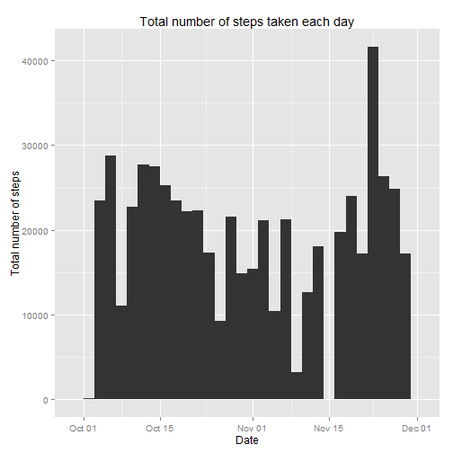
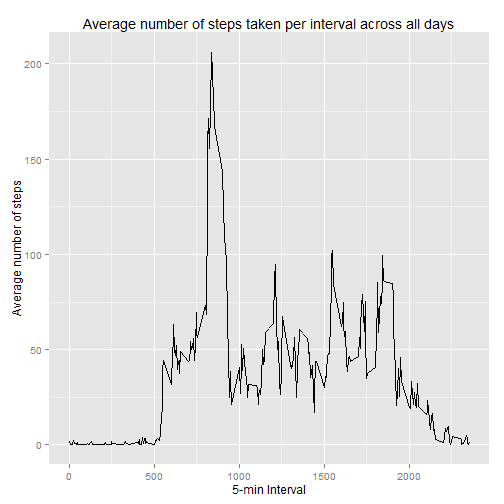
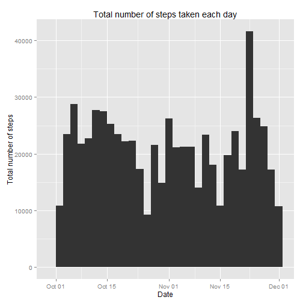
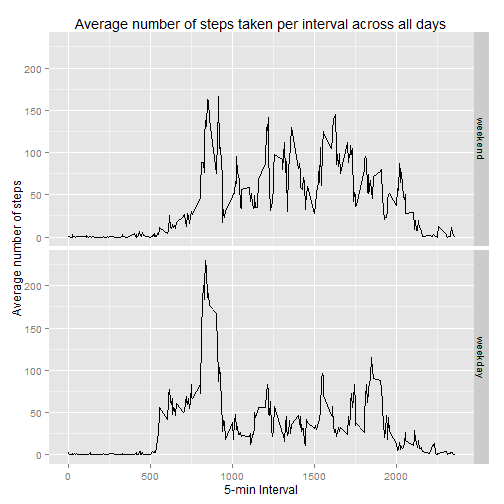

This document contains the R code and the answers to the questions detailed
in Peer Assignment 1 of the Reproducible Research course.

##1.Loading and preprocessing the data


```r
library(reshape)
library(reshape2)
library(ggplot2)
zipname <- "activity.zip"
filename <- "activity.csv"
    if (!file.exists(zipname)) {
        fileURL <- "https://d396qusza40orc.cloudfront.net/repdata%2Fdata%2Factivity.zip"
        download.file(fileURL,zipname,method="curl")
    }
```

```
## Warning: running command 'curl "https://d396qusza40orc.cloudfront.net/
## repdata%2Fdata%2Factivity.zip" -o "activity.zip"' had status 127
```

```
## Warning in download.file(fileURL, zipname, method = "curl"): download had
## nonzero exit status
```

```r
    if (!file.exists(filename)) {
        unzip(zipname)
    }
data <- read.csv("activity.csv")
data[,2] <- as.Date(data$date,format = "%Y-%m-%d", origin = "2012-10-01")
```

##2.What is mean total number of steps taken per day?


```r
options(scipen=999)

# Calculate the total number of steps taken per day
sdata <- data[,1:2]
sdata.melt <- melt(sdata, id = c("date"))
sdata.total <- dcast(sdata.melt,date ~ variable,fun.aggregate = sum)

# Make a histogram of the total number of steps taken each day
h <- ggplot(sdata,aes(x=date))
h + geom_histogram(aes(weight=steps),binwidth = 2) +
labs(x="Date") +
labs(y="Total number of steps") +
labs(title="Total number of steps taken each day")
```

 

```r
# Calculate the mean and median of the total number of steps taken per day
tsmean <- mean(sdata.total$steps,na.rm=TRUE)
tsmedian <- median(sdata.total$steps,na.rm=TRUE)
```

The mean of the total number of steps taken per day is 10766.1886792.

The median of the total number of steps taken per day is 10765.

##3.What is the average daily activity pattern?


```r
# Make a time series plot of the 5-minute interval and the average number of steps taken, averaged across all days
idata <- as.data.frame(cbind(data$interval,data$steps))
idata <- rename(idata,c(V1 = "interval", V2 = "steps"))
idata.melt <- melt(idata, id=c("interval"))
idata.mean <- dcast(idata.melt,interval ~ variable, fun.aggregate =  mean,na.rm = TRUE)
i <- ggplot(idata.mean,aes(x=interval,y=steps))
i + geom_line() +
labs(x="5-min Interval") +
labs(y="Average number of steps") +
labs(title="Average number of steps taken per interval across all days")
```

 

```r
# Find the 5-minute interval, on average across all the days in the dataset, contains the maximum number of steps
maxstep <- max(idata.mean$steps)
imaxpos <- which(grepl(maxstep,idata.mean$steps))
imax <- idata.mean$interval[imaxpos]
```

5-minute interval 835,  on average across all the days in the dataset, contains the maximum number of steps 206.1698113.

##4.Imputing missing values


```r
# Calculate the total number of missing values in the dataset 
nNA <- sum(is.na(data))

# Create a new dataset that is equal to the original dataset but with the missing data filled in using mean for that time interval
ndata <- data
napos <- which(is.na(data))
    for (i in 1:length(napos)) {
        intervalpos <- which(data$interval[napos[i]] == idata.mean$interval)
        ndata$steps[napos[i]] <- idata.mean$steps[intervalpos]
    }

# Make a histogram of the total number of steps taken each day
nh <- ggplot(ndata,aes(x=date))
nh + geom_histogram(aes(weight=steps),binwidth = 2) +
labs(x="Date") +
labs(y="Total number of steps") +
labs(title="Total number of steps taken each day")
```

 

```r
# Calculate the mean and median of the total number of steps taken per day
nsdata <- ndata[,1:2]
nsdata.melt <- melt(nsdata, id = c("date"))
nsdata.total <- dcast(nsdata.melt,date ~ variable,fun.aggregate = sum)
nsmean <- mean(nsdata.total$steps)
nsmedian <- median(nsdata.total$steps)
```

Strategy for imputing missing data:

Missing data is filled with the mean of the time interval in which the missing data is recorded.


The total number of missing values in the dataset is 2304 .

The mean of the total number of steps taken per day is 10766.1886792.

The median of the total number of steps taken per day is 10766.1886792.

The mean of the total number of steps taken per day does not differ from the first part of the assignment. Both are 10766.1886792.

The median of the total number of steps taken per day differs from the first part of the assignment. Changing from 10765 to 10766.1886792.

Imputing missing data makes median the same as mean for the estimates of the
total dialy number of steps. 

##5.Are there differences in activity patterns between weekdays and weekends?


```r
# Create a new factor variable in the dataset with two levels - "weekday" and "weekend" indicating whether a given date is a weekday or weekend day
weekdays <- c('Monday', 'Tuesday', 'Wednesday', 'Thursday', 'Friday')
ndata$weekday <- factor((weekdays(ndata$date) %in% weekdays),
        levels=c(FALSE, TRUE), labels=c('weekend', 'weekday'))

# Make a panel plot containing a time series plot of the 5-minute interval (x-axis) and the average number of steps taken, averaged across all weekday days or weekend days (y-axis).
ndata$date <- NULL
ndata.melt <- melt(ndata, id=c("interval","weekday"))
ndata.mean <- dcast(ndata.melt,interval + weekday ~ variable, fun.aggregate =  mean)
ni <- ggplot(ndata.mean,aes(x=interval,y=steps))
ni + geom_line() +
facet_grid(weekday~.) +
labs(x="5-min Interval") +
labs(y="Average number of steps") +
labs(title="Average number of steps taken per interval across all days")
```

 

